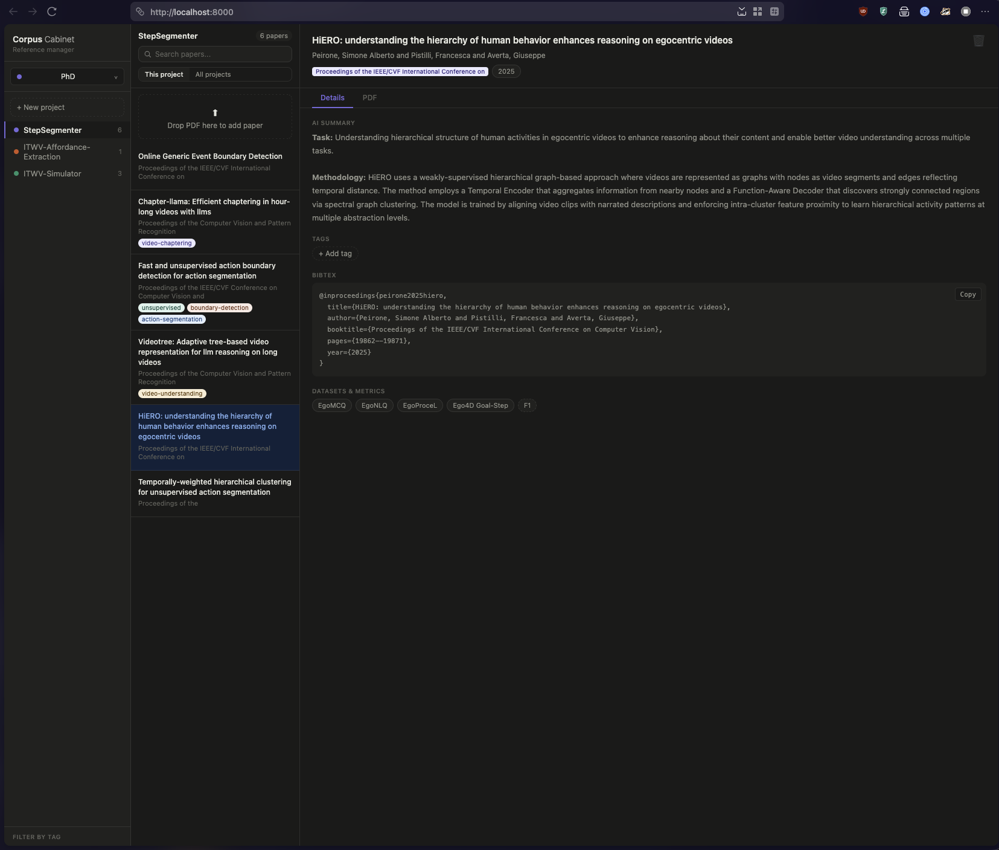
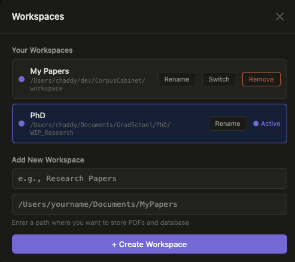

# Corpus Cabinet

A no-nonsense personal academic reference manager built to fit one specific workflow: download a paper, drop it in, and immediately have everything you need — the right BibTeX, the conference it was published at, and a concise AI summary of what the paper actually does.

Built because existing tools like Zotero get the job half done. Zotero gives you arXiv links instead of conference BibTeX. It doesn't tell you what the paper's methodology is. It doesn't organise papers the way a researcher actually thinks about them. Corpus Cabinet does.



---

## Why I built this

These were the pain points:

- **Zotero's BibTeX is wrong for ML papers.** It links to the arXiv preprint, not the conference publication. If your paper was published at CVPR 2023, you want a `@inproceedings` entry with the correct venue — not an arXiv URL your advisor will flag in review.
- **No quick summary.** Opening a paper to remember what it does breaks flow. I wanted a two-sentence answer to "what does this paper do and how?" without reopening the PDF.
- **Projects don't map to how I think.** I read papers in clusters — by topic, by related works section, by reading list for a specific experiment. I wanted project folders that mirror that, each with its own isolated set of papers.
- **Drag and drop should just work.** Drop a PDF, done. Everything else is automated.

The goal was a simple, fast, local app that fits into a research workflow without getting in the way.

---

## Features

- **Proper conference BibTeX** — fetched from Google Scholar via SerpAPI, not arXiv. Gets the actual `@inproceedings` entry with venue, year, and pages.
- **AI summaries** — Claude reads the paper and extracts: what task it addresses, what the core methodology is, which datasets were used, and which metrics were evaluated.
- **Drag-and-drop upload** — drop a PDF onto the app. It extracts the title, queries Scholar, runs the AI summary, and saves everything. No forms to fill.
- **Projects** — organise papers into named, colour-coded projects (like reading lists or related-works groups). Each project gets its own folder on disk.
- **Tags** — add freeform tags to papers and filter by them in the sidebar.
- **Search** — search by title within a project or across all projects.
- **One-click BibTeX copy** — open a paper, click Copy. Paste into your `.bib` file.
- **Dark mode** — follows your system preference.

---

## Planned

- **Cluster view** — after building up a project, automatically group papers by topic using embeddings. The goal is to have a "related works radar" — see which papers cluster together so you can structure a literature review without manually sorting.

---

## Stack

| Layer | Technology |
|---|---|
| Backend framework | FastAPI |
| Server | Uvicorn |
| Database | SQLite via SQLAlchemy |
| PDF parsing | PyMuPDF |
| Scholar metadata | SerpAPI |
| AI summaries | Anthropic Claude API |
| Frontend | Vanilla JS + HTML/CSS (no build step) |

---

## Setup

### Prerequisites

- Docker + Docker Compose, **or** Python 3.11+
- A [SerpAPI](https://serpapi.com) key (free tier: 100 searches/month)
- An [Anthropic](https://console.anthropic.com) API key

### 1. Clone and configure

```bash
git clone https://github.com/your-username/CorpusCabinet.git
cd CorpusCabinet
cp .env.example .env
```

Edit `.env` and fill in your API keys:

```env
SERPAPI_KEY=your_serpapi_key_here
ANTHROPIC_API_KEY=your_anthropic_key_here
```

### 2. Run with Docker (recommended)

```bash
docker compose up --build
```

Open [http://localhost:8000](http://localhost:8000).

Your database and PDFs are stored in `./workspace/` on your host machine and persist across container restarts.

### 3. Run locally (without Docker)

```bash
python -m venv venv
source venv/bin/activate      # Windows: venv\Scripts\activate
pip install -r requirements.txt
uvicorn main:app --reload
```

Open [http://localhost:8000](http://localhost:8000).

---

## How to use

### Creating a workspace

A workspace is a self-contained folder that holds your entire database and all uploaded PDFs. You can point Corpus Cabinet at any folder on your machine — useful for keeping a work workspace separate from a personal one, or for backing up to a cloud-synced folder like Dropbox.

To set your workspace path, open **Settings** (bottom of the sidebar) and enter a directory path. Corpus Cabinet will create the folder if it doesn't exist and initialise a fresh database inside it.



The workspace folder structure:

```
your-workspace/
├── corpus_cabinet.db      ← all metadata, tags, and paper records
└── projects/
    └── {project_name}/
        └── paper.pdf      ← original uploaded PDFs
```

### Creating a project

Click **+ New project** in the sidebar and enter a name. Projects are colour-coded for easy identification. Each project gets its own subfolder inside the workspace.

### Adding a paper

1. Select a project in the sidebar.
2. Drag a PDF onto the drop zone in the middle panel, or click it to open a file picker.
3. The upload pipeline runs automatically:
   - Title extracted from the PDF
   - Google Scholar queried for metadata + BibTeX
   - Claude generates a structured summary
4. The paper appears in the list when processing is complete (typically 5–15 seconds).

### Viewing a paper

Click any paper card to open the detail panel on the right, which shows:

- Title, authors, conference, year
- AI summary — task and methodology in plain English
- Tags
- BibTeX (with copy button)
- Datasets and evaluation metrics extracted by AI

### Tagging

In the detail panel, click **+ Add tag** to add a tag to a paper. Type a new tag name or select an existing one from the suggestions. Tags are auto-coloured and appear in the sidebar for filtering.

To filter by tag, click any tag in the **Filter by tag** section of the sidebar. Click again to clear the filter.

### Searching

Use the search bar at the top of the middle panel to filter by title. Use the **This project / All projects** toggle to scope the search.

### Copying BibTeX

Open a paper, scroll to the BibTeX section, and click **Copy**. The full BibTeX entry is copied to your clipboard.

---

## Limitations

- Upload pipeline is synchronous — the request blocks while Scholar + Claude run. For personal use this is fine; large batches will be slow.
- Scholar metadata quality depends on SerpAPI finding the paper. Niche or very new papers may not match.
- Title extraction is heuristic (largest font on page 1) and occasionally picks up a section header instead of the actual title.
